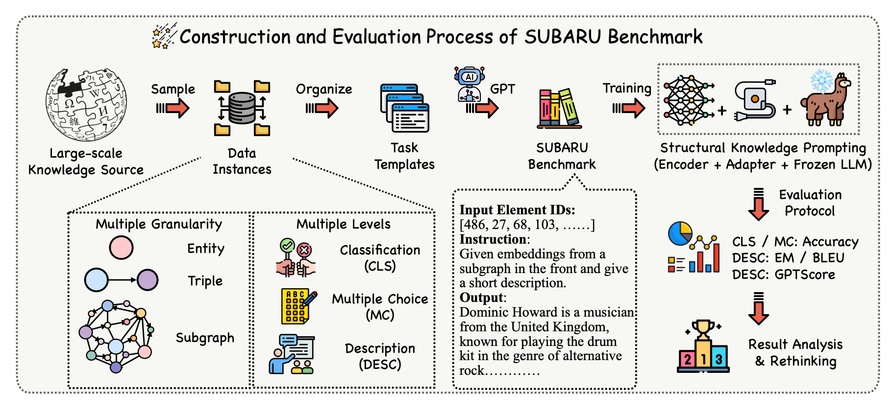

# Have We Designed Generalizable Structural Knowledge Promptings? Systematic Evaluation and Rethinking

> Large language models (LLMs) have demonstrated exceptional performance in text generation within current NLP research. However, the lack of factual accuracy is still a dark cloud hanging over the LLM skyscraper. Structural knowledge prompting (SKP) is a prominent paradigm to integrate external knowledge into LLMs by incorporating structural representations, achieving state-of-the-art results in many knowledge-intensive tasks. However, existing methods often focus on specific problems, lacking a comprehensive exploration of the generalization and capability boundaries of SKP. This paper aims to evaluate and rethink the generalization capability of the SKP paradigm from four perspectives including Granularity, Transferability, Scalability, and Universality. To provide a thorough evaluation, we introduce a novel multi-granular, multi-level benchmark called SUBARU, consisting of 9 different tasks with varying levels of granularity and difficulty. Through extensive experiments, we draw key conclusions regarding the generalization of SKP, offering insights to guide the future development and extension of the SKP paradigm.

## 🌟 Overview



## 💻 Data preparation

- We have provide the data in the [Google Drive](https://drive.google.com/file/d/1zprwx8X2E4r498iUZZob9afYhoPDT24j/view?usp=sharing). You need to download the datasets and put them in the `data/` path.

## 📕 Training & Test

- Training SKP model: `bash train_batch.sh`
- Inference on a task: `python inference_understanding.py`
- You can modify the scripts to change the dataset and task for training and evaluation.


## 🤝 Citation
```
@misc{zhang2024subaru,
      title={Have We Designed Generalizable Structural Knowledge Promptings? Systematic Evaluation and Rethinking}, 
      author={Yichi Zhang and Zhuo Chen and Lingbing Guo and Yajing Xu and Shaokai Chen and Mengshu Sun and Binbin Hu and Zhiqiang Zhang and Lei Liang and Wen Zhang and Huajun Chen},
      year={2024},
      eprint={2501.00244},
      archivePrefix={arXiv},
      primaryClass={cs.CL},
      url={https://arxiv.org/abs/2501.00244}, 
}
```